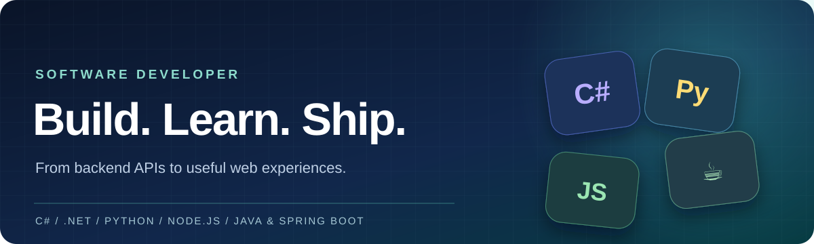

<!-- GitHub profile setup: create a public repository whose name exactly matches your GitHub username. Put this README.md and profile-banner.svg in the repository root. Replace YOUR_NAME and YOUR_USERNAME with your details. -->

  

  <h1>Hi, I'm YOUR_NAME 👋</h1>
  
<strong>Software Developer</strong> · Building practical applications with a versatile backend stack

  

    
  

About me

I enjoy turning ideas into reliable applications and learning across languages and frameworks. My toolkit spans C# and .NET, Python, Node.js, and Java with Spring Boot.

Tech stack

  &nbsp;&nbsp;
  &nbsp;&nbsp;
  &nbsp;&nbsp;
  &nbsp;&nbsp;
  &nbsp;&nbsp;
  

Core stack

Technology

Focus

C# · .NET

APIs and backend applications

Python

Automation and data processing

JavaScript · Node.js

Server-side applications

Java · Spring Boot

Web services and enterprise systems

Let's connect

Interested in collaborating? Explore my work on GitHub →.
<!doctype html>
<html lang="en" data-bs-theme="dark">
<head>
  <meta charset="utf-8">
  <meta name="viewport" content="width=device-width, initial-scale=1">
  <meta name="description" content="Software developer profile featuring C#, .NET, Python, Node.js and Java Spring Boot.">
  <title>YOUR_NAME · Software Developer</title>
  <link href="https://cdn.jsdelivr.net/npm/bootstrap@5.3.8/dist/css/bootstrap.min.css" rel="stylesheet" integrity="sha384-sRIl4kxILFvY47J16cr9ZwB07vP4J8+LH7qKQnuqkuIAvNWLzeN8tE5YBujZqJLB" crossorigin="anonymous">
  
</head>
<body>
  <main class="container py-4 py-md-5">
    
    <header class="row align-items-end gy-3 pt-4 pt-md-5 pb-4">
      

Hello, world 👋
<h1 class="display-5 fw-bold mb-2">I'm YOUR_NAME.</h1>
A software developer building practical applications across modern backend technologies.

      
<a class="btn btn-accent btn-lg px-4" href="https://github.com/YOUR_USERNAME?tab=repositories" target="_blank" rel="noopener noreferrer">Explore my GitHub ↗</a>

    </header>
    <section aria-labelledby="about-heading" class="glass p-4 p-md-5 my-4">
About me
<h2 id="about-heading" class="section-title h3">Ideas into working software.</h2>
I enjoy turning ideas into reliable applications and learning across languages and frameworks. My toolkit spans C# and .NET, Python, Node.js, and Java with Spring Boot.
</section>
    <section aria-labelledby="skills-heading" class="py-4">
Toolbox
<h2 id="skills-heading" class="section-title h2 mb-4">Tech stack</h2>

      

C#

Application development

      

.NET

Backend services

      

Python

Scripting &amp; automation

      

Node.js

APIs &amp; web applications

      

Java

Backend development

      

Spring Boot

Web services

    
</section>
    <footer class="border-top mt-5 py-4 d-flex flex-column flex-sm-row justify-content-between gap-2" style="border-color:var(--stroke)!important">Built with Bootstrap · Designed for developers<a href="https://github.com/YOUR_USERNAME" target="_blank" rel="noopener noreferrer">GitHub profile ↗</a></footer>
  </main>
</body>
</html>

<!-- Optional: add real project links and your verified email or LinkedIn URL here. -->
